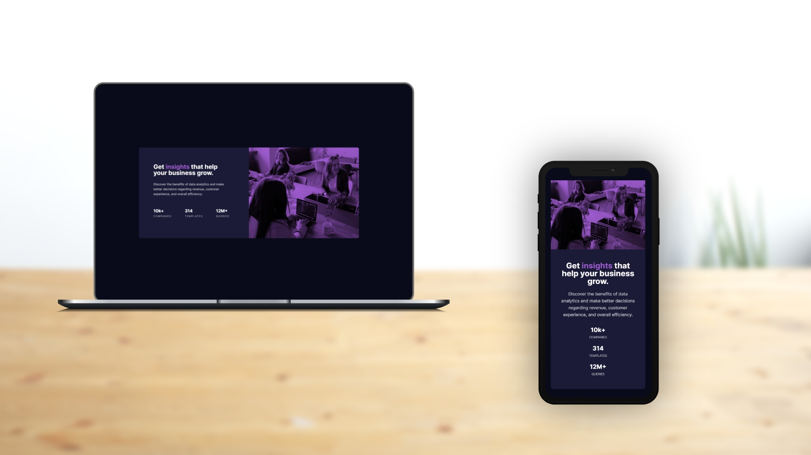

# Stats preview card component

This is a solution to the [Stats preview card component challenge on Frontend Mentor](https://www.frontendmentor.io/challenges/stats-preview-card-component-8JqbgoU62). 

## Table of contents

- [Stats preview card component](#stats-preview-card-component)
  - [Table of contents](#table-of-contents)
  - [Overview](#overview)
    - [The challenge](#the-challenge)
    - [Screenshot](#screenshot)
    - [Links](#links)
  - [Front-end Style Guide](#front-end-style-guide)
    - [Layout](#layout)
    - [Colors](#colors)
    - [Typography](#typography)
    - [Fonts](#fonts)
  - [My process](#my-process)
    - [Built with](#built-with)
  - [Author](#author)

## Overview

### The challenge

Users should be able to:

- View the optimal layout depending on their device's screen size

### Screenshot

### Links

- Live Site URL: [https://benjaminvillatte.github.io/fem-stats-preview-card-component/](https://benjaminvillatte.github.io/fem-stats-preview-card-component/)

## Front-end Style Guide

### Layout

The designs were created to the following widths:

- Mobile: 375px
- Desktop: 1440px

### Colors

_Primary_

- Very dark blue (main background): hsl(233, 47%, 7%)
- Dark desaturated blue (card background): hsl(244, 38%, 16%)
- Soft violet (accent): hsl(277, 64%, 61%)

_Neutral_

- White (main heading, stats): hsl(0, 0%, 100%)
- Slightly transparent white (main paragraph): hsla(0, 0%, 100%, 0.75)
- Slightly transparent white (stat headings): hsla(0, 0%, 100%, 0.6)

### Typography

- Font size: 15px

### Fonts

- Family: [Inter](https://fonts.google.com/specimen/Inter)
- Weights: 400, 700

- Family: [Lexend Deca](https://fonts.google.com/specimen/Lexend+Deca)
- Weights: 400

## My process

### Built with

- CSS custom properties
- Flexbox
- Mobile-first workflow
- Vitejs for hrm and build

## Author

- Website - [Benjamin VILLATTE](https://benjaminvillatte.fr)
